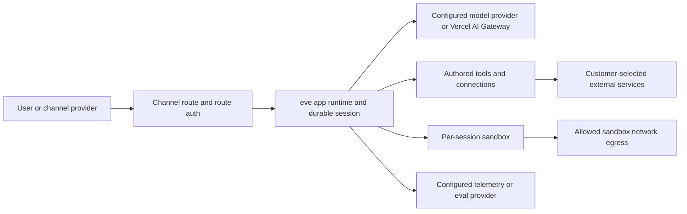

你的 eve agent 跨两个 contexts 运行，它们之间有 trust boundary，所有 secret 都保留在 trusted side。在决定 agent（以及驱动它的 model）允许访问什么时，请使用这个心智模型。

## Trust boundaries

|                         | App runtime  | Sandbox               |
| ----------------------- | ------------ | --------------------- |
| `process.env` / secrets | Yes          | No                    |
| Your Node.js code       | Yes          | No                    |
| Network                 | Unrestricted | Controlled by policy  |
| Filesystem              | App's own    | Isolated `/workspace` |

app runtime 是 trusted side。你的 tool implementations、model calls、connections、state 和 durable execution 都在这里运行，并且可以使用 `process.env` 和完整 Node.js。（在 Vercel 上，它是 Vercel Function。）

sandbox 是 isolated side。model 会通过 built-in `bash`、`read_file`、`write_file`、`glob` 和 `grep` tools 在其中运行 shell commands。它拥有自己的 `/workspace` filesystem，但没有 `process.env`、没有 secrets，也没有回到 app runtime 的路径。（在 Vercel 上，每个 sandbox 都是带有 hardware-level isolation 的 [Vercel Sandbox](https://vercel.com/docs/sandbox) microVM。）只有 shell commands 会在 sandbox 中执行。即使是 built-in `bash`/`read_file`/`write_file` tools，也存在于 app runtime 中，并 _proxy_ 到 sandbox。model 看到的是 tool definitions 和 results，永远不是你的 secrets。

一个具体 trace 可以让边界更清楚。当 model 调用 custom `charge_card` tool 时，它的 `execute` 会在 app runtime 中运行，读取 `process.env.STRIPE_KEY`，调用 Stripe，并返回 `{ ok: true }`。model 只会看到 `{ ok: true }`：key 永远不会离开 app runtime，该调用也不会触及 sandbox。built-in `write_file` 是镜像情况：它在 app runtime 中运行，并把 write proxy 到 sandbox `/workspace`。无论哪种方式，model 都是通过 tool calls 及其 results 驱动工作，而不是持有 credential 或直接访问 runtime。

## Data flow 概览

eve 会把数据发送到你的 agent configuration 和 runtime choices 指定的位置：

- Inbound channel data 会流经你配置的 channel provider，然后进入 eve app runtime。
- Model inputs 和 outputs 会流向 `agent.ts` 中选择的 model 或 routing path，例如 Vercel AI Gateway model id 或 provider-authored `LanguageModel`。
- Tool 和 connection calls 会流向你配置的 external services、MCP servers、OpenAPI endpoints 和 channels。
- Sandbox commands 可以访问 sandbox network policy 允许的 network destinations。
- Telemetry 和 eval data 会流向你在 `instrumentation.ts` 或 eval settings 中配置的 exporters 和 providers。

eve 会存储恢复 conversations、stream events、replay completed steps 和展示 run observability 所需的 durable session 与 workflow state。你有责任判断所选 channels、model providers、connected services、sandbox egress destinations、telemetry exporters、retention settings 和 deletion controls 是否适合你的数据和 use case。

## Credential brokering

当没有 [tool](../tools) 或 [connection](../connections) 可以路由时，credential brokering 会让 model 从 sandbox 内获得 _authenticated_ network access，例如对 private repo 执行 `git clone`，或执行 authenticated `curl`。在 Vercel Sandbox backend 上，auth headers 会在 sandbox 的 network firewall 处为匹配 domains 注入。secret 保留在 app runtime 中；sandbox process 只会看到 response。平台机制见 [Vercel Sandbox Credential Brokering](https://vercel.com/docs/sandbox/concepts/firewall#credentials-brokering)，eve policy API 见 [Sandbox](../sandbox)。

## Connection credentials

[Connection](../connections) tokens（MCP 和 OpenAPI）来自 `getToken()` 或 interactive OAuth flow，eve 会把解析出的 token 注入每个 outbound request。token 按 step 缓存，永远不会序列化到 durable state。

## Channel verification

[channel](../channels/overview) 是 agent 的入口，因此 authenticating inbound traffic 是它的职责。built-in platform channels 遵循两条规则，你自己编写的任何 channel 也必须遵循：

- **以 constant time 验证 signatures。** Platform channels（Slack、GitHub、
  Telegram、Twilio）会对 raw request body 上的平台 HMAC signature
  进行 constant-time comparison，因此 response timing 无法泄露 forged
  signature。对任何你检查的 secret 都要使用 constant-time compare，永远不要对
  signature 使用 `===`。
- **不要信任 body-supplied identity。** 从 _verified_
  signature 或 token 派生 caller，永远不要从 request body 声称的
  `principalId`（或类似字段）派生。body field 由 attacker 控制；把它当作 identity 是
  cross-user impersonation。

接受 dashboard-style webhooks 的 custom channel 应遵循同样形状：用 HMAC authenticate raw body，以 constant time 比较 signatures，并且只有在 signature 验证后才信任任何 body-supplied principal。

## Authored markdown 是数据

[Skill](../skills) 和 [schedule](../schedules) files 是带有 YAML frontmatter 的 markdown，eve 严格把这些 frontmatter 视为数据。支持代码的 engines（`---js` / `---javascript`，会在文件解析时立即 `eval()` frontmatter body）已被禁用，因此这种 fence 会 throw，而不是运行。Frontmatter 必须解析为 plain YAML object。

## Auth fails closed

Routes 默认拒绝 unauthenticated traffic。如果 walk 中没有 `AuthFn` 接受 request，它会得到 `401`；允许 anonymous callers 需要显式使用 `none()`。scaffold 的 `placeholderAuth()` 会让半配置 app 在 production 中保持关闭，直到你替换它。完整 walk 和 verifiers 见 [Auth & route protection](../guides/auth-and-route-protection)。

## Production 前 checklist

在把 agent 暴露给真实 traffic 前：

- [ ] 将 `agent/channels/eve.ts` 中的 `placeholderAuth()` 替换为真实
      `AuthFn`（`vercelOidc()`、`httpBasic()`、`oidc()` 或你自己的）。验证
      unauthenticated production request 会得到 `401`。
- [ ] 验证 channel signatures。每个 platform channel 都需要设置 signing
      secret；custom channels 必须以 constant time 验证 signatures，并且永远不要
      信任 body-supplied identity。
- [ ] 将 secrets 保留在 `process.env` 中，永远不要放进 compiled artifacts，也永远不要
      传入 sandbox。通过 tools 或 connections 路由 privileged calls。
- [ ] 将 connection tokens scope 到 agent 需要的最小权限；它们会到达 hosts，但永远不会到达 model。
- [ ] 如果 model 不应拥有 open egress，请设置比 `allow-all` 更严格的 sandbox network policy；
      对 authenticated egress 使用 credential brokering。
- [ ] 不要把 untrusted text 作为 markup 暴露。渲染到 channel UI 中、由 model 或 user 控制的
      strings 应针对该 surface 进行 escape。

## 接下来阅读

- [Auth & route protection](../guides/auth-and-route-protection)：完整 auth walk 和 verifier helpers
- [Sandbox](../sandbox)：backends、network policy 和 brokering config
- [Execution model and durability](./execution-model-and-durability)：durable sessions 如何运行
- [Connections](../connections)：static-token 和 OAuth connections
